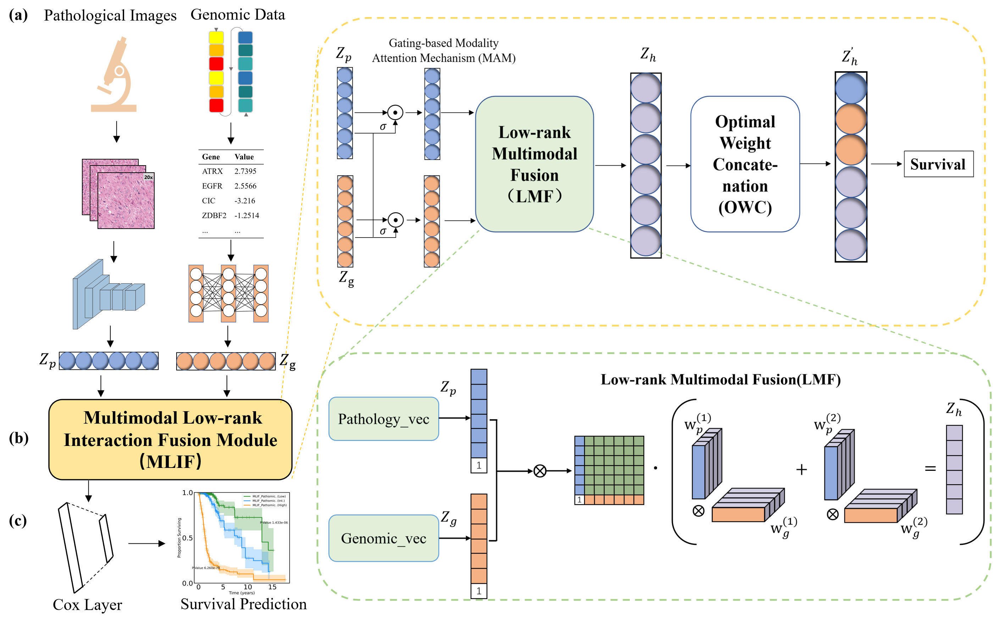

# PG-MLIF: Multimodal Low-rank Interaction Fusion Framework Integrating Pathological Images and Genomic Data for Cancer Prognosis




## Updates:
* 06/27/2024: Updated Google Drive with all models and processed data for TCGA-GBMLGG and TCGA-KIRC. found using the [following link](https://drive.google.com/drive/u/1/folders/1swiMrz84V3iuzk8x99vGIBd5FCVncOlf)

## Overview
 We propose a Multimodal Low-rank Interaction Fusion Framework Integrating Pathological images and Genomic data (PG-MLIF) for survival prediction. In this framework, we leverage the gating-based modality attention mechanism (MAM) for effective filtering at the feature level and propose the optimal weight concatenation (OWC) strategy to maximize the integration of information from pathological images, genomic data, and fused features at the model level. The model introduces for the first time a parallel decomposition strategy called low-rank multimodal fusion (LMF), which simplifies the complexity and facilitates model contribution-based fusion, addressing the challenge of incomplete and inefficient multimodal fusion. Extensive experiments on the public dataset of GBMLGG and KIRC demonstrate that our PG-MLIF outperforms state-of-the-art survival prediction methods. Additionally, we significantly stratify patients based on the hazard ratios obtained from training the two types of datasets, and the visualization results were generally consistent with the true grade classification.

## Setup

### 1. Prerequisites
- Linux (Tested on Ubuntu 18.04)
- NVIDIA GPU (Tested on Nvidia GeForce RTX 3080Ti Tis on local workstations, and Nvidia V100s using Google Cloud)
- CUDA + cuDNN (Tested on CUDA 10.1 and cuDNN 7.5. CPU mode and CUDA without CuDNN may work with minimal modification, but untested.)
- torch>=1.1.0
- torch_geometric=1.3.0

### 2. Code Base Structure
The code base structure is explained below: 
- **train_cv.py**: Cross-validation script for training unimodal and multimodal networks. This script will save evaluation metrics and predictions on the train + test split for each epoch on every split in **checkpoints**.
- **test_cv.py**: Script for testing unimodal and unimodal networks on only the test split.
- **train_test.py**: Contains the definitions for "train" and "test". 
- **networks.py**: Contains PyTorch model definitions for all unimodal and multimodal network.
- **fusion.py**: Contains PyTorch model definitions for fusion.
- **data_loaders.py**: Contains the PyTorch DatasetLoader definition for loading multimodal data.
- **options.py**: Contains all the options for the argparser.
- **make_splits.py**: Script for generating a pickle file that saves + aligns the path for multimodal data for cross-validation.
- **run_cox_baselines.py**: Script for running Cox baselines.
- **utils.py**: Contains definitions for collating, survival loss functions, data preprocessing, evaluation, figure plotting, etc...
- **Evalutation-GBMLGG.py**:COX survival analysis and visualization

The directory structure for your multimodal dataset should look similar to the following:
```bash
./
├── data
      └── PROJECT
            ├── INPUT A (e.g. Image)
                ├── image_001.png
                ├── image_002.png
                ├── ...
            ├── INPUT C (e.g. Genomic)
                ├──  genomic_data.csv
└── checkpoints
        └── PROJECT
            ├── Survival Analysis
                ├── path
                    ├── ...
                ├── ...
```

Depending on which modalities you are interested in combining, you must: (1) write your own function for aligning multimodal data in **make_splits.py**, (2) create your DatasetLoader in **data_loaders.py**, (3) modify the **options.py** for your data and task. Models will be saved to the **checkpoints** directory, with each model for each task saved in its own directory. At the moment, the only supervised learning tasks implemented are survival outcome prediction and grade classification.

### 3. Training and Evaluation
#### Survival Model for Input P and G
```
python train_cv.py --exp_name surv_15_rnaseq --task surv --mode pathomic --model_name PG-MLIF --niter 10 --niter_decay 20 --lr 0.0001 --beta1 0.5 --fusion_type pofusion --mmhid 64 --use_bilinear 1 --use_vgg_features 1 --gpu_ids 0 --omic_gate 0 --path_gate 0 --use_rnaseq 1 --input_size_omic 320 --skip 1
```
```
python test_cv.py --exp_name surv_15_rnaseq --task surv --mode pathomic --model_name PG-MLIF --niter 10 --niter_decay 20 --lr 0.0001 --beta1 0.5 --fusion_type pofusion --mmhid 64 --use_bilinear 1 --use_vgg_features 1 --gpu_ids 0 --omic_gate 0 --path_gate 0 --use_rnaseq 1 --input_size_omic 320 --skip 1
```

## Acknowledgments
This code is inspired by [SALMON](https://github.com/huangzhii/SALMON), [pytorch-CycleGAN-and-pix2pix](https://github.com/junyanz/pytorch-CycleGAN-and-pix2pix), [SCNN](https://github.com/CancerDataScience/SCNN)，and [pathomic fusion](https://github.com/mahmoodlab/PathomicFusion).

## Contact

If you have any question, please contact [pxp201@guet.edu.cn](mailto:pxp201@guet.edu.cn).

Documentation of the instructions for a specific run is available at:

./data/TCGA_GBMLGG/README.md
